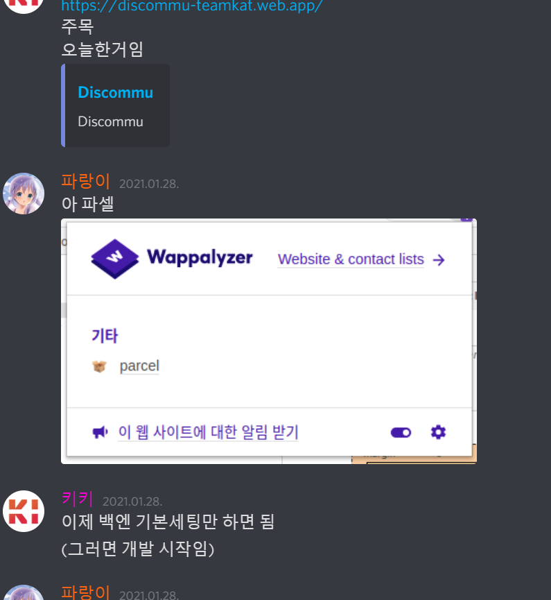

# 팀 내부
우리 팀은 ~~비정상적으로~~자유롭습니다.

이게 뭐가 문제냐고요?
여기 공지채널이에요~~네 공지채널에서 잡담을 합니다~~

## 팀 내 규칙
1. 선은 지키기
2. github 팀 레포나 팀계정 테러하지 않기

## 팀 커밋 규칙
1. 커밋은 최대한 [이거](https://www.conventionalcommits.org/ko/v1.0.0/) 지켜주세요. 물론 필수는 아니에요
2. 3달에 최소 1회 커밋해주세요

## 프로젝트
+ 팀원은 자유롭게 프로젝트 생성이 가능합니다(`#새_프젝`에 regex에 맞게 보내고 오너가 수락하면 카테고리가 생깁니다)
+ 팀원 프로젝트 참가는 github 레포를 보고 참가원하는 프로젝트가 있으면 (`#프젝_참가_신청`에 원하는 프젝 레포나 이름 말하시면 프젝 제작자가 수락하면 됩니다)

## 역할
### MEMBER
   ㄴ 그냥 팀멤버
- Github 모든 레포스토리지 볼수 있음
- CONTRIBUTE는 PULL REQUEST로 하거나 팀 제작자가 직접 권한을 줘야함
- 프로젝트 제작 가능
- 투표, 단체회의 참가 가능

### SPONSER
   ㄴ 팀에게 후원을 하는 아주 멋진사람
- 깃허브 로그 볼수 있음
- 후원시 후원금액이 어디 사용되었는지 어떻게 사용됬는지 알수 있음

### HELPER
   ㄴ 팀에게 도움을 주는사람(테스터 버그발견한사람 등)
- 실험채널 볼수 있음

### OUTSIDE CONTRIBUTER
   ㄴ 팀원이 특정 프로젝트에 컨트리뷰트를 하는데 팀원은 아닌 사람
- 팀원전용 채팅 볼수 있음
- 컨트리뷰트하는 프로젝트 카테고리 볼수 있음
- 컨트리뷰트하는 프로젝트 깃허브 볼수있음 (컨트리뷰트 가능)

### HIGH MEMBER
   ㄴ 팀원중 참가를 많이했는등 팀에 대한 영향이 크면 하이멤버다(오너가 판단)
- 팀원 권한 전체
- 추천가능
- 서버 로그 볼수 있음
- 공지 작성 가능
- 실험채널 볼수 있음